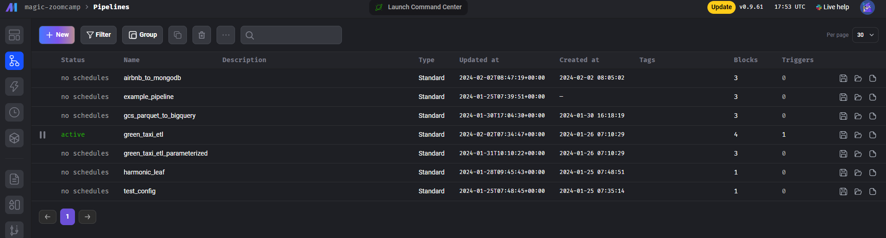
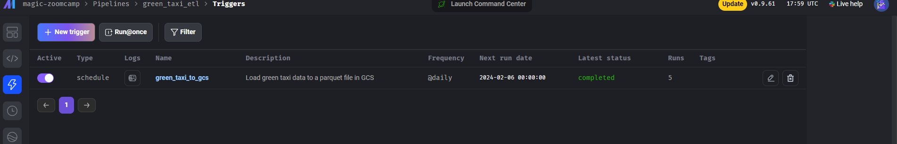
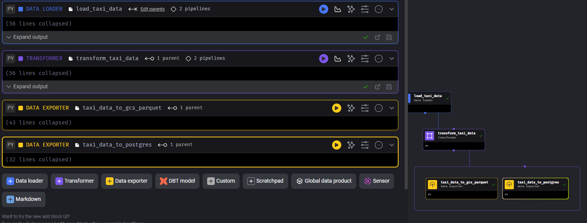
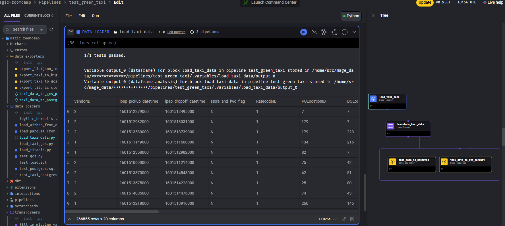
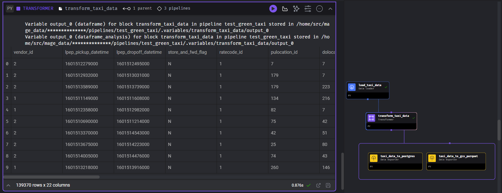
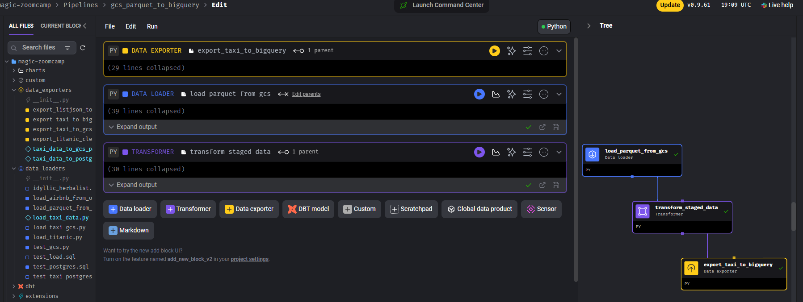

# Data Engineering Zoomcamp Course 2024
# Module 2: Workflow Orchestration

Repo for tasks and homeworks included in the Module 2: Data Engineering Zoomcamp course Cohort 2024.

## Homework

#### Run Mage in a docker container

It's very easy, just follow the instructions in this [repo](https://github.com/mage-ai/mage-zoomcamp).

As a summary:

``` 
git clone https://github.com/mage-ai/mage-zoomcamp.git mage-zoomcamp
cd mage-data-engineering-zoomcamp
docker compose build
docker compose up
```

Now, you can navigate to http://localhost:6789 in your browser! And start doing the homework.

### Pipeline green_taxi_etl
I've built the `green_taxi_etl` in Mage. All the components and pipeline definition are saved in the folder `my-mage-code`: pipelines, data_exporters, data_loaders, transformers and io_config and metadata yaml files.

Imagen Pipelines


The trigger created and successfully executed:



The ETL components and the tree structure:



Components:
- Data Loaders: load_taxi_data.py
- Transformers: transform_taxi_data.py
- Data exporters: 
    - taxi_data_to_gcs_parquet.py
    - taxi_data_to_postgres.py
- Pipelines: green_taxi_data with the trigger saved,


In the folder **Module02/my-mage-code**, you cand find the Mage blocks I've created to complete the homework and some others I've built to test Mage functionalities (some of them are still in progress).

NOTE: The **vendor_id column should only contain values 1 or 2** as it is defined in the [documentation of TLC](https://www.nyc.gov/assets/tlc/downloads/pdf/data_dictionary_trip_records_green.pdf). 

In the assertion, I've hardcoded the accepted values for vendor_id, but it'd be a best practice to parameterized this values.

#### Run the pipeline 

You can easily recreate the pipeline: 
- Copy the components, previously described, saved in `my-mage-code` to the following folders in `mage-zoomcamp/magic_zoomcamp`:
    - data_loaders: load_taxi_data.py
    - transformers: transform_taxi_data.py
    - data_exporters: taxi_data_to_gcs_parquet.py and taxi_data_to_postgres.py
- Create a new Pipeline
- Edit the pipeline and move the components to the `Tree` designer
- Connect the inputs and outputs of the block properly
- Run the pipeline

Screenshots of some block execution to show the ressults:




## Other works
I've also built the pipeline `gcs_parquet_to_bigquery` to move the data in parquet format from the GCS bucket (where we saved it in the previous pipeline) to Bigquery.


And the components:




## Content of this Module

Welcome to Week 2 of the Data Engineering Zoomcamp! 🚀😤 This week, we'll be covering workflow orchestration with Mage.

Mage is an open-source, hybrid framework for transforming and integrating data. ✨

This week, you'll learn how to use the Mage platform to author and share magical data pipelines. This will all be covered in the course, but if you'd like to learn a bit more about Mage, check out our docs here.

- 2.2.1 - 📯 Intro to Orchestration
- 2.2.2 - 🧙‍♂️ Intro to Mage
- 2.2.3 - 🐘 ETL: API to Postgres
- 2.2.4 - 🤓 ETL: API to GCS
- 2.2.5 - 🔍 ETL: GCS to BigQuery
- 2.2.6 - 👨‍💻 Parameterized Execution
- 2.2.7 - 🤖 Deployment (Optional)
- 2.2.8 - 🧱 Advanced Blocks (Optional)


# License

Copyright 2023 Eduardo Muñoz

   Licensed under the Apache License, Version 2.0 (the "License");
   you may not use this file except in compliance with the License.
   You may obtain a copy of the License at

       http://www.apache.org/licenses/LICENSE-2.0

   Unless required by applicable law or agreed to in writing, software
   distributed under the License is distributed on an "AS IS" BASIS,
   WITHOUT WARRANTIES OR CONDITIONS OF ANY KIND, either express or implied.
   See the License for the specific language governing permissions and
   limitations under the License.

