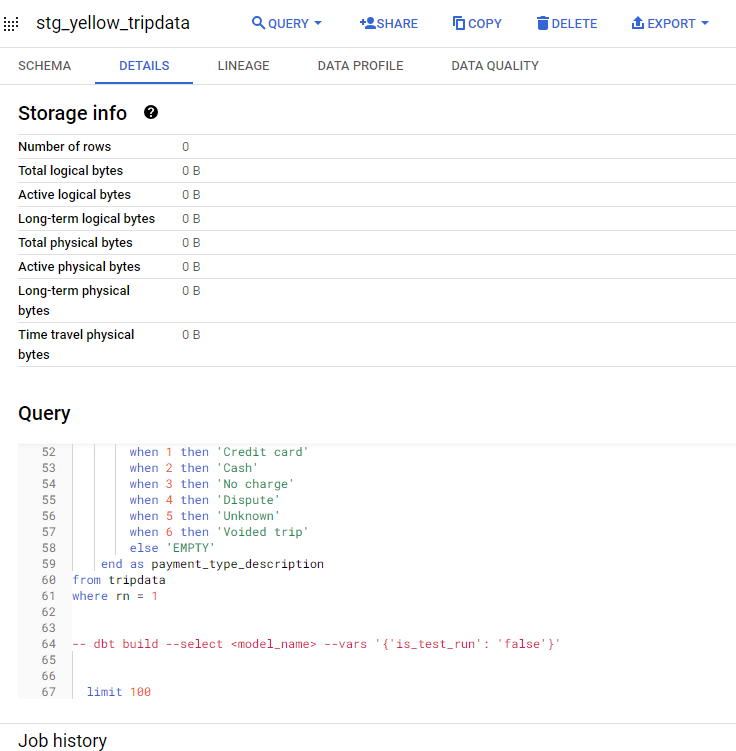
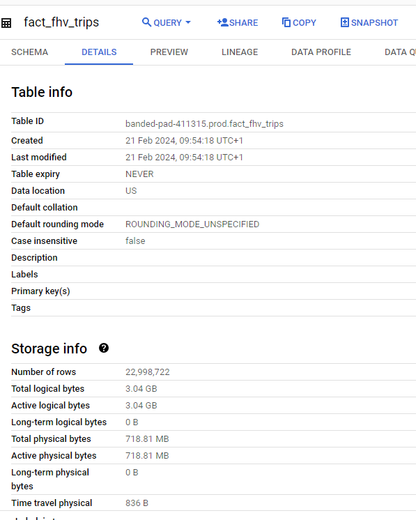
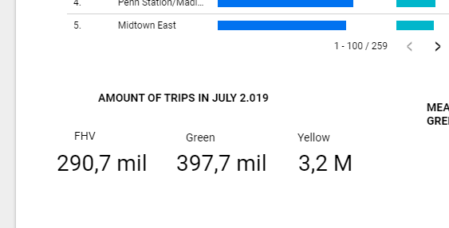

# Data Engineering Zoomcamp Course 2024
# Module 4: Data Analytics

Goal: Transforming the data loaded in DWH into Analytical Views developing a dbt project.

1. Introduction to analytics engineering
2. What is dbt?
3. Starting a dbt project
4. dbt models
5. Testing and documenting dbt models
6. Deployment
7. Visualising the transformed data: Looker Studio

## Module - Homework 

In this homework, we'll use the models developed during the week 4 videos and enhance the already presented dbt project using the already loaded Taxi data for fhv vehicles for year 2019 in our DWH.

This means that in this homework we use the following data [Datasets list](https://github.com/DataTalksClub/nyc-tlc-data/)
* Yellow taxi data - Years 2019 and 2020
* Green taxi data - Years 2019 and 2020 
* fhv data - Year 2019. 

We will use the data loaded for:

* Building a source table: `stg_fhv_tripdata`
* Building a fact table: `fact_fhv_trips`
* Create a dashboard 

If you don't have access to GCP, you can do this locally using the ingested data from your Postgres database
instead. If you have access to GCP, you don't need to do it for local Postgres - only if you want to.

**Data Ingestion**
Data has been moved to Google Storage in CSV format via Mage and then, in Big Query Studio, we have created the tables and uploaded the data from the bucket.


> **Note**: if your answer doesn't match exactly, select the closest option 

### Question 1: 

**What happens when we execute dbt build --vars '{'is_test_run':'true'}'**
You'll need to have completed the ["Build the first dbt models"](https://www.youtube.com/watch?v=UVI30Vxzd6c) video. 
- It's the same as running *dbt build*
- It applies a _limit 100_ to all of our models
- It applies a _limit 100_ only to our staging models
- Nothing

**Answer**: It applies a _limit 100_ only to our staging models.

For the staging models, the views stg_yellow_tripdata, stg_green_tripdata and stg_fhv_tripdata are created with the limit 100. The production models are created by the Nightly job that runs the command ```dbt build --vars '{'is_test_run':'false'}'``` that omits the limit 100 instruction.

We can check the stg_yellow_tripdata view in BigQuery to confirm the limit 100:



### Question 2: 

**What is the code that our CI job will run? Where is this code coming from?**  

- The code that has been merged into the main branch
- The code that is behind the creation object on the dbt_cloud_pr_ schema
- The code from any development branch that has been opened based on main
- The code from the development branch we are requesting to merge to main

**Answer**: The code from the development branch we are requesting to merge to main

### Question 3 (2 points)

**What is the count of records in the model fact_fhv_trips after running all dependencies with the test run variable disabled (:false)?**  
Create a staging model for the fhv data, similar to the ones made for yellow and green data. Add an additional filter for keeping only records with pickup time in year 2019.
Do not add a deduplication step. Run this models without limits (is_test_run: false).

Create a core model similar to fact trips, but selecting from stg_fhv_tripdata and joining with dim_zones.
Similar to what we've done in fact_trips, keep only records with known pickup and dropoff locations entries for pickup and dropoff locations. 
Run the dbt model without limits (is_test_run: false).

- 12998722
- 22998722
- 32998722
- 42998722

**Answer**: 22,998,722

Our job Nightly, run a dbt build without limits (is_test_run_ false) to build the tables in prod enviroment. We can check the fact_fhv_trip table in prod to see how many rows it has:



### Question 4 (2 points)

**What is the service that had the most rides during the month of July 2019 month with the biggest amount of rides after building a tile for the fact_fhv_trips table?**

Create a dashboard with some tiles that you find interesting to explore the data. One tile should show the amount of trips per month, as done in the videos for fact_trips, including the fact_fhv_trips data.

- FHV
- Green
- Yellow
- FHV and Green

**Answer**: Yellow

I'm quite confused about this question, but I think is asking for the service with the biggest amount of trips in July 2,019. So, Yellow service had many more trips, about 10 times more.



## Dashboard

Link to the [dashboard](https://lookerstudio.google.com/s/sgT6E-6VVfw)

