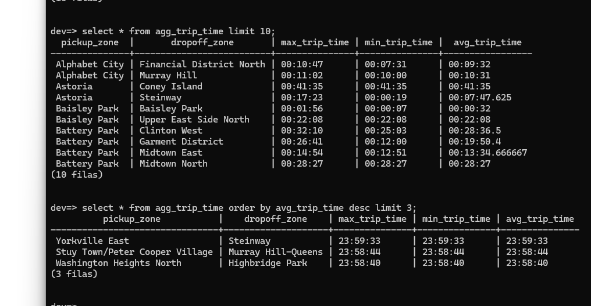
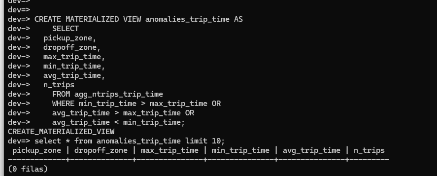
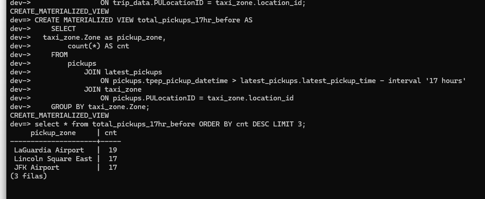

# Homework

## Setting up

In order to get a static set of results, we will use historical data from the dataset.

Run the following commands:
```bash
# Load the cluster op commands.
source commands.sh
# First, reset the cluster:
clean-cluster
# Start a new cluster
start-cluster
# wait for cluster to start
sleep 5
# Seed historical data instead of real-time data
seed-kafka
# Recreate trip data table
psql -f risingwave-sql/table/trip_data.sql
# Wait for a while for the trip_data table to be populated.
sleep 5
# Check that you have 100K records in the trip_data table
# You may rerun it if the count is not 100K
psql -c "SELECT COUNT(*) FROM trip_data"
```

## Question 0

_This question is just a warm-up to introduce dynamic filter, please attempt it before viewing its solution._

What are the dropoff taxi zones at the latest dropoff times?

For this part, we will use the [dynamic filter pattern](https://docs.risingwave.com/docs/current/sql-pattern-dynamic-filters/).

Midtown Center 2022-01-03 17:24:54

<details>
<summary>Solution</summary>

```sql
CREATE MATERIALIZED VIEW latest_dropoff_time AS
    WITH t AS (
        SELECT MAX(tpep_dropoff_datetime) AS latest_dropoff_time
        FROM trip_data
    )
    SELECT taxi_zone.Zone as taxi_zone, latest_dropoff_time
    FROM t,
            trip_data
    JOIN taxi_zone
        ON trip_data.DOLocationID = taxi_zone.location_id
    WHERE trip_data.tpep_dropoff_datetime = t.latest_dropoff_time;

--    taxi_zone    | latest_dropoff_time
-- ----------------+---------------------
--  Midtown Center | 2022-01-03 17:24:54
-- (1 row)
```

</details>

## Question 1

Create a materialized view to compute the average, min and max trip time **between each taxi zone**.

From this MV, find the pair of taxi zones with the highest average trip time.
You may need to use the [dynamic filter pattern](https://docs.risingwave.com/docs/current/sql-pattern-dynamic-filters/) for this.

Bonus (no marks): Create an MV which can identify anomalies in the data. For example, if the average trip time between two zones is 1 minute,
but the max trip time is 10 minutes and 20 minutes respectively.

Options:
1. Yorkville East, Steinway
2. Murray Hill, Midwood
3. East Flatbush/Farragut, East Harlem North
4. Midtown Center, University Heights/Morris Heights

**Answer**: 1. Yorkville East, Steinway

Create a MV to store the max, min and avg trip time between the pickup and dropoff zones.:
```sql
CREATE MATERIALIZED VIEW agg_trip_time AS
    SELECT 
	taxi_zone.Zone as pickup_zone, 
	taxi_zone_1.Zone as dropoff_zone, 
	MAX(tpep_dropoff_datetime-tpep_pickup_datetime) as max_trip_time,
	MIN(tpep_dropoff_datetime-tpep_pickup_datetime) as min_trip_time,
	AVG(tpep_dropoff_datetime-tpep_pickup_datetime) as avg_trip_time
    FROM trip_data
    JOIN taxi_zone ON trip_data.PULocationID = taxi_zone.location_id
    JOIN taxi_zone as taxi_zone_1 ON trip_data.DOLocationID = taxi_zone_1.location_id
    GROUP BY taxi_zone.Zone, taxi_zone_1.Zone;
```

and then we select or extract the 3 pickup-dropoff zones with largest avg trip time:
```
dev=> select * from agg_trip_time order by avg_trip_time desc limit 3;
          pickup_zone           |    dropoff_zone    | max_trip_time | min_trip_time | avg_trip_time
--------------------------------+--------------------+---------------+---------------+---------------
 Yorkville East                 | Steinway           | 23:59:33      | 23:59:33      | 23:59:33
 Stuy Town/Peter Cooper Village | Murray Hill-Queens | 23:58:44      | 23:58:44      | 23:58:44
 Washington Heights North       | Highbridge Park    | 23:58:40      | 23:58:40      | 23:58:40
(3 filas)
```

Solution: 1. Yorkville East, Steinway




## Question 2

Recreate the MV(s) in question 1, to also find the **number of trips** for the pair of taxi zones with the highest average trip time.

Options:
1. 5
2. 3
3. 10
4. 1

**Answer**:1

Create a MV similar to the previous one but including the number of trips between the pickup and dropoff zones:
```sql
CREATE MATERIALIZED VIEW agg_ntrips_trip_time AS
    SELECT 
	taxi_zone.Zone as pickup_zone, 
	taxi_zone_1.Zone as dropoff_zone, 
	MAX(tpep_dropoff_datetime-tpep_pickup_datetime) as max_trip_time,
	MIN(tpep_dropoff_datetime-tpep_pickup_datetime) as min_trip_time,
	AVG(tpep_dropoff_datetime-tpep_pickup_datetime) as avg_trip_time,
	COUNT(*) as n_trips
    FROM trip_data
    JOIN taxi_zone ON trip_data.PULocationID = taxi_zone.location_id
    JOIN taxi_zone as taxi_zone_1 ON trip_data.DOLocationID = taxi_zone_1.location_id
    GROUP BY taxi_zone.Zone, taxi_zone_1.Zone;
```

and then then we select or extract the 3 pickup-dropoff zones with largest avg trip time:
```
dev=> select * from agg_ntrips_trip_time order by avg_trip_time desc limit 3;
          pickup_zone           |    dropoff_zone    | max_trip_time | min_trip_time | avg_trip_time | n_trips
--------------------------------+--------------------+---------------+---------------+---------------+---------
 Yorkville East                 | Steinway           | 23:59:33      | 23:59:33      | 23:59:33      |       1
 Stuy Town/Peter Cooper Village | Murray Hill-Queens | 23:58:44      | 23:58:44      | 23:58:44      |       1
 Washington Heights North       | Highbridge Park    | 23:58:40      | 23:58:40      | 23:58:40      |       1
(3 filas)
```


**Optional**:

Create a MV to extract from the previous MV some anomalies like min trip times greater than max trip time, ans things like that:
```sql
CREATE MATERIALIZED VIEW anomalies_trip_time AS
    SELECT 
	pickup_zone, 
	dropoff_zone, 
	max_trip_time,
	min_trip_time,
	avg_trip_time,
	n_trips
    FROM agg_ntrips_trip_time
    WHERE min_trip_time > max_trip_time OR
	  avg_trip_time > max_trip_time OR
	  avg_trip_time < min_trip_time;

    JOIN taxi_zone ON trip_data.PULocationID = taxi_zone.location_id
    JOIN taxi_zone as taxi_zone_1 ON trip_data.DOLocationID = taxi_zone_1.location_id
    GROUP BY taxi_zone.Zone, taxi_zone_1.Zone;
```
But this approach do not return any rows.



## Question 3

From the latest pickup time to 17 hours before, what are the top 3 busiest zones in terms of number of pickups?
For example if the latest pickup time is 2020-01-01 12:00:00,
then the query should return the top 3 busiest zones from 2020-01-01 11:00:00 to 2020-01-01 12:00:00.

HINT: You can use [dynamic filter pattern](https://docs.risingwave.com/docs/current/sql-pattern-dynamic-filters/)
to create a filter condition based on the latest pickup time.

NOTE: For this question `17 hours` was picked to ensure we have enough data to work with.

Options:
1. Clinton East, Upper East Side North, Penn Station
2. LaGuardia Airport, Lincoln Square East, JFK Airport
3. Midtown Center, Upper East Side South, Upper East Side North
4. LaGuardia Airport, Midtown Center, Upper East Side North

**Answer**: 2. LaGuardia Airport, Lincoln Square East, JFK Airport

Create a group of MV to get the pickups, the lastest pickups and the total pickups before 17 hours from the latest pickups:
```sql
CREATE MATERIALIZED VIEW pickups as
SELECT
    tpep_pickup_datetime,
    pulocationid
FROM
    trip_data
        JOIN taxi_zone
            ON trip_data.PULocationID = taxi_zone.location_id;

CREATE MATERIALIZED VIEW latest_pickups AS
    SELECT
        max(tpep_pickup_datetime) AS latest_pickup_time
    FROM
        trip_data
            JOIN taxi_zone
                ON trip_data.PULocationID = taxi_zone.location_id;


CREATE MATERIALIZED VIEW total_pickups_17hr_before AS
    SELECT
	taxi_zone.Zone as pickup_zone,
        count(*) AS cnt
    FROM
        pickups
            JOIN latest_pickups
                ON pickups.tpep_pickup_datetime > latest_pickups.latest_pickup_time - interval '17 hours'
            JOIN taxi_zone
                ON pickups.PULocationID = taxi_zone.location_id
    GROUP BY taxi_zone.Zone;
```

then we can extract the top 3 locations with more pickups within the 17 hours before the lastest pickup:
```
select * from total_pickups_17hr_before ORDER BY cnt DESC LIMIT 3;
```



CREATE MATERIALIZED VIEW latest_pickups as
SELECT
    tpep_pickup_datetime,
    pulocationid
FROM
    trip_data
        JOIN taxi_zone
            ON trip_data.PULocationID = taxi_zone.location_id;

CREATE MATERIALIZED VIEW latest_pickups_17hr_before AS
    WITH t AS (
        SELECT MAX(tpep_pickup_datetime) AS latest_pickup_time
        FROM trip_data
    )
    SELECT taxi_zone.Zone as taxi_zone, latest_pickup_time
    FROM t,
            trip_data
    JOIN taxi_zone
        ON trip_data.PULocationID = taxi_zone.location_id
    WHERE trip_data.tpep_pickup_datetime = t.latest_dropoff_time;

CREATE MATERIALIZED VIEW latest_pickups_17hr_before AS
    SELECT
        count(*) AS cnt
    FROM
        airport_pu
            JOIN latest_jfk_pickup
                ON airport_pu.tpep_pickup_datetime > latest_jfk_pickup.latest_pickup_time - interval '1 hour'
            JOIN taxi_zone
                ON airport_pu.PULocationID = taxi_zone.location_id
    WHERE
        taxi_zone.Borough = 'Queens'
      AND taxi_zone.Zone = 'JFK Airport';